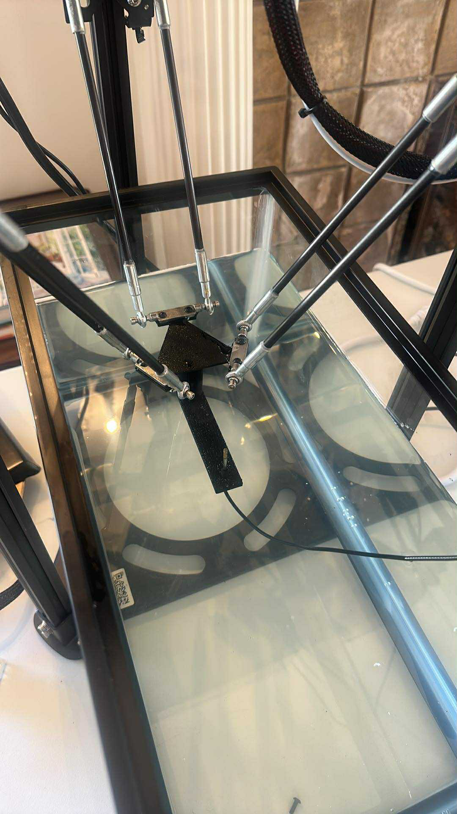

# Hydrophone Scanning Tank

I turned a 3D printer into a hydrophone scanning tank.

## Materials

- FLSUN Q5 delta-style 3D printer, bought on Ebay for $200
- 5.5 Gallon tank ([Aqueon Standard Glass Rectangle Aquarium](https://www.petsmart.com/fish/tanks-aquariums-and-nets/aquariums/aqueon-standard-glass-rectangle-aquarium-78711.html))
- ONDA Hydrophone
- [Lab stand](https://www.amazon.com/QWORK-Laboratory-Metalware-Support-Condenser/dp/B0CF5NY4W4/) for holding the ultrasound transmit probe
