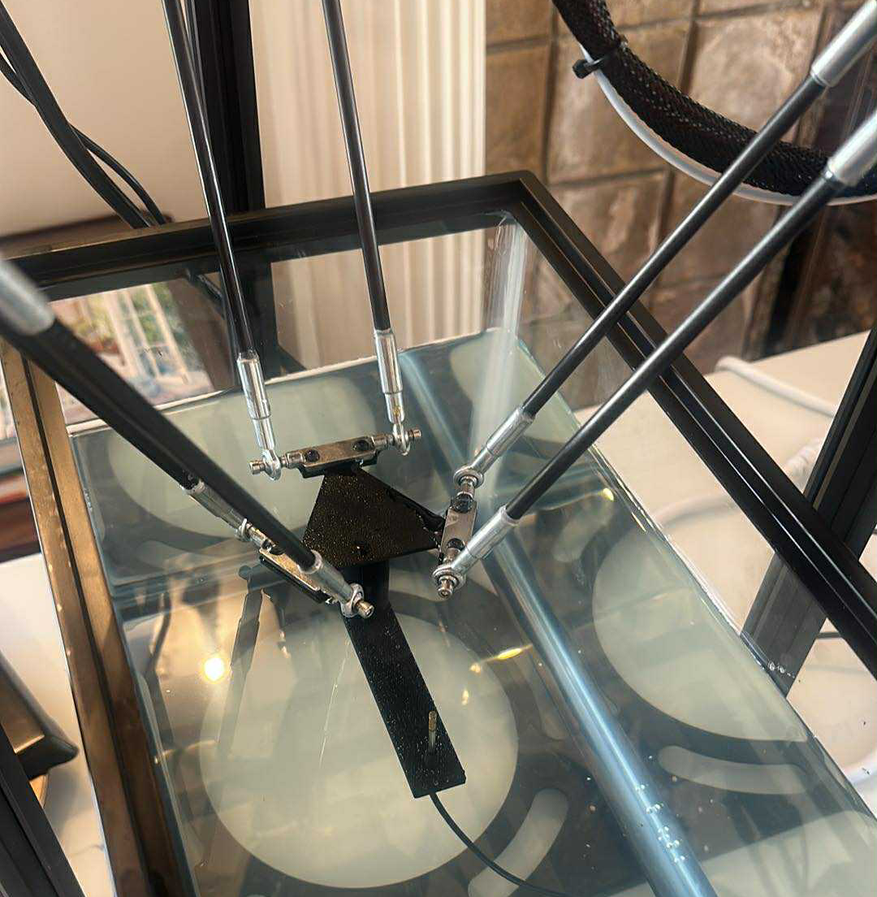

# Hydrophone Scanning Tank

I turned a 3D printer into a hydrophone scanning tank. This was ~100x cheaper than buying a hydrophone scanning tank (>$50k).



## Usage

Start the backend:
```bash
uv run scanning-tank
```

Start the frontend (in a separate terminal):
```bash
cd frontend
pnpm dev
```

Then open http://localhost:5173 in your browser.

**Keyboard controls:**
- `W/A/S/D` - Move X/Y axes
- `Q/E` - Move Z axis
- `H` - Home all axes
- `Space` - Read pressure

## Materials

| Item                                                       | Price  | Link                                                                                                                             |
| ---------------------------------------------------------- | ------ | -------------------------------------------------------------------------------------------------------------------------------- |
| FLSUN Q5 delta-style 3D printer                            | $200   | Ebay                                                                                                                             |
| 5.5 Gallon tank (Aqueon Standard Glass Rectangle Aquarium) | $15    | [Petsmart](https://www.petsmart.com/fish/tanks-aquariums-and-nets/aquariums/aqueon-standard-glass-rectangle-aquarium-78711.html) |
| ONDA HNR-5000 Hydrophone                                   | $3,800 | [ONDA Corp](https://www.ondacorp.com/hnr-needle-hydrophone/)                                                                     |
| Lab stand for holding the ultrasound transmit probe        | $20    | [Amazon](https://www.amazon.com/QWORK-Laboratory-Metalware-Support-Condenser/dp/B0CF5NY4W4/)                                     |
